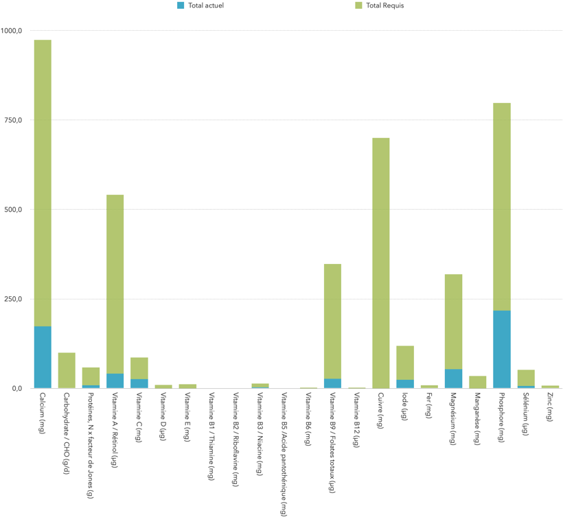

<!-- markdownlint-disable MD041 -->

  

    <a href="#Introduction">Introduction</a> •
    <a href="#Background">Background</a> •
    <a href="#Objectives">Objectives</a> •
    <a href="#Nutrition Recommendations">Nutrition Recommendations</a> •
    <a href="#Case study">Case study</a> •
    <a href="#About the Author">About the Author</a> •

# How to improve your Nutrition to avoid Mood Swings ?
A balanced diet rich in nutrients can help stabilize mood and 
reduce symptoms of depression, anxiety, and other mental health conditions.

As you navigate different stages of life, your nutritional needs evolve to meet unique physiological demands and health challenges. To ensure 
optimal health support and quality of life, it's essential to adopt customized nutrition strategies tailored to your specific age group.

This post provides a detailed overview of evidence-based recommendations for various life stages, from infancy to seniority. My primary goal is 
to empower you with precise, scientifically-grounded guidance that addresses both your unique nutrient requirements and distinct health risks and 
needs.

Whether you're seeking to optimize your overall well-being or manage specific health concerns, this foundational guide serves as a trusted resource 
for you to make informed decisions about your nutrition and promote healthy living throughout all stages of life.
# Background
Understanding the pivotal role of nutrition counseling across different age brackets necessitates a grasp of the evolving physiological needs and health dynamics encountered throughout the human lifespan. Nutrition, being a cornerstone of health, plays a crucial role in shaping growth, development, and overall well-being from infancy to old age. Infants require specific nutrients to support rapid growth and development, while children and adolescents face unique nutritional challenges during periods of growth spurts and cognitive development. In adulthood, nutrition becomes instrumental in maintaining optimal health and preventing chronic diseases, with considerations shifting towards factors such as metabolism and lifestyle choices. As individuals enter the senior years, nutritional needs evolve yet again, often accompanied by changes in appetite, digestion, and nutrient absorption, alongside an increased susceptibility to certain health conditions. By recognizing the continuum of nutritional requirements and health challenges across different age groups, tailored nutrition strategies can be developed to optimize health outcomes and enhance quality of life at every stage of the human lifespan.

# Objectives
The primary aim of this post is to provide accessible, evidence-based nutrition guidance that addresses the diverse physiological requirements and health challenges encountered across different stages of life. Specifically, the post aims to:
<ul>
<li>Offer scientifically-grounded recommendations tailored to the unique nutrient needs and health risks associated with each age group, from infancy to seniority.</li>
<li>Promote a balanced diet that includes a variety of foods from all food groups, with an emphasis on fruits, vegetables, whole grains, lean proteins, and dairy products.</li>
<li>Offer recommendations for maintaining hydration, managing appetite changes, and addressing swallowing difficulties or dental issues that may impact nutrition.</li>

</ul>

# Nutrition Recommendations
## Nutritional Requirements for Different Age Groups and Conditions
Based on the U.S. Food and Drug
Administration here is the Reference Daily Intakes
(RDIs)

| Nutrient         | Unit of measure       | Adults and Children ≥ 4 years | ¹Infants through 12 months | Children 1 through 3 years | Pregnant women and lactating women |
|------------------|-----------------------|-------------------------------|----------------------------|----------------------------|------------------------------------|
| Vitamin A        | Micrograms RAE² (mcg) | 900                           | 500                        | 300                        | 1300                               |
| Vitamin C        | Milligrams (mg)       | 90                            | 50                         | 15                         | 120                                |
| Calcium          | Milligrams (mg)       | 1300                          | 260                        | 700                        | 1300                               |
| Iron             | Milligrams (mg)       | 18                            | 11                         | 7                          | 27                                 |
| Vitamin D        | Micrograms (mcg)³     | 20                            | 10                         | 15                         | 15                                 |
| Vitamin E        | Milligrams (mg)⁴      | 15                            | 5                          | 6                          | 19                                 |
| Vitamin K        | Micrograms (mcg)      | 120                           | 2.5                        | 30                         | 90                                 |
| Thiamin          | Milligrams (mg)       | 1.2                           | 0.3                        | 0.5                        | 1.4                                |
| Riboflavin       | Milligrams (mg)       | 1.3                           | 0.4                        | 0.5                        | 1.6                                |
| Niacin           | Milligrams NE⁵ (mg)   | 16                            | 4                          | 6                          | 18                                 |
| Vitamin B6       | Milligrams (mg)       | 1.7                           | 0.3                        | 0.5                        | 2                                  |
| Folate⁶          | Micrograms DFE⁷ (mcg) | 400                           | 80                         | 150                        | 600                                |
| Vitamin B12      | Micrograms (mcg)      | 2.4                           | 0.5                        | 0.9                        | 2.8                                |
| Biotin           | Micrograms (mcg)      | 30                            | 6                          | 8                          | 35                                 |
| Pantothenic acid | Milligrams (mg)       | 5                             | 1.8                        | 2                          | 7                                  |
| Phosphorus       | Milligrams (mg)       | 1250                          | 275                        | 460                        | 1250                               |
| Iodine           | Micrograms (mcg)      | 150                           | 130                        | 90                         | 290                                |
| Magnesium        | Milligrams (mg)       | 420                           | 75                         | 80                         | 400                                |
| Zinc             | Milligrams (mg)       | 11                            | 3                          | 3                          | 13                                 |
| Selenium         | Micrograms (mcg)      | 55                            | 20                         | 20                         | 70                                 |
| Copper           | Milligrams (mg)       | 0.9                           | 0.2                        | 0.3                        | 1.3                                |
| Manganese        | Milligrams (mg)       | 2.3                           | 0.6                        | 1.2                        | 2.6                                |
| Chromium         | Micrograms (mcg)      | 35                            | 5.5                        | 11                         | 45                                 |
| Molybdenum       | Micrograms (mcg)      | 45                            | 3                          | 17                         | 50                                 |
| Chloride         | Milligrams (mg)       | 2300                          | 570                        | 1500                       | 2300                               |
| Potassium        | Milligrams (mg)       | 4700                          | 700                        | 3000                       | 5100                               |
| Choline          | Milligrams (mg)       | 550                           | 150                        | 200                        | 550                                |
| Protein          | Grams (g)             | -                             | 11                         | -                          | 87                                 |

¹ Infants through 12 months.
² RAE: Retinol Activity Equivalents.
³ Vitamin D values are for adults.
⁴ Vitamin E values are for adults.
⁵ NE: Niacin Equivalents.
⁶ Folate includes synthetic folic acid.
⁷ DFE: Dietary Folate Equivalents.
source: [RDI](https://www.fda.gov/media/99069/download)

## Nutritional Components for Different Age Groups and Conditions

| Component            | Unit of measure      | Adults and Children ≥ 4 years | Infants through 12 months | Children 1 through 3 years | Pregnant women and lactating women |
|----------------------|----------------------|-------------------------------|---------------------------|----------------------------|------------------------------------|
| Fat                  | Grams (g)            | 178                           | 30                        | 239                        | 178                                |
| Saturated fat        | Grams (g)            | 120                           | N/A                       | 210                        | 120                                |
| Cholesterol          | Milligrams (mg)      | 300                           | N/A                       | 300                        | 300                                |
| Total carbohydrates  | Grams (g)            | 1275                          | 95                        | 2150                       | 1275                               |
| Sodium               | Milligrams (mg)      | 2,300                         | N/A                       | 1,500                      | 2,300                              |
| Dietary Fiber        | Grams (g)            | 128                           | N/A                       | 214                        | 128                                |
| Protein              | Grams (g)            | 150                           | N/A                       | 213                        | N/A                                |
| Added sugars         | Grams (g)            | 150                           | N/A                       | 225                        | 150                                |

source: [RDV](https://www.fda.gov/media/99059/download)

# Case study

---
## How to improve your nutrition

Potato gratin, known as "[Kartoffelgratin-klassisch](https://www.kochbar.de/rezept/193433/Kartoffelgratin-klassisch.html?personen=1)" in Germany, is a popular dish deeply rooted in European culinary traditions. Typically comprised of layers of thinly sliced potatoes, rich cream, butter, cheese, and often a touch of garlic or nutmeg, this delightful comfort food is both hearty and indulgent. While its savory flavors and creamy texture offer a satisfying dining experience, it is essential to understand the nutritional implications of incorporating such a dish into the regular diet of various demographic groups.

For a 32-year-old woman, maintaining a balanced diet is crucial for overall health, optimal metabolic function, and the prevention of chronic diseases. This demographic often faces unique nutritional requirements due to factors such as hormone regulation, bone health, and energy expenditure. With an understanding of these specific needs, it becomes pertinent to assess how the consumption of classic potato gratin aligns with or diverges from these dietary guidelines.

This study aims to explore the nutritional composition of Kartoffelgratin-klassisch and evaluate its effects on the dietary balance and health outcomes for a 32-year-old woman. We will examine macronutrient distribution, micronutrient content, caloric intake, and potential health benefits and risks associated with regular consumption of this dish. By doing so, we hope to provide a comprehensive understanding of how this beloved culinary classic fits within the nutritional framework for women in this demographic.

### Hypothesis

---

 The consumption of 300g of Kartoffelgratin-klassisch (potato gratin) in a single day by a 32-year-old woman will moderately impact her daily caloric and macronutrient intake but will not exceed the recommended dietary allowances when balanced with other nutrient-dense foods throughout the day.

Rationale:
- A 300g serving of Kartoffelgratin-klassisch is expected to be relatively high in calories, carbohydrates, and fats.
- This hypothesis assumes that the remaining meals and snacks consumed throughout the day will be adjusted to maintain an overall balanced intake of nutrients.
- The analysis will consider the nutritional needs specific to a 32-year-old woman, including daily caloric intake and macronutrient distribution.

Objectives:
1. To analyze the caloric content, macronutrient distribution (carbohydrates, fats, proteins), and key micronutrients (e.g., calcium, vitamin A, vitamin C) provided by a 300g serving of potato gratin.
2. To assess whether the consumption of 300g of potato gratin impacts her ability to meet her daily recommended dietary intake when balanced with other meals.

Expected Outcomes:
1. The hypothesis will be supported if the analysis shows that the 300g serving of potato gratin, does not meet the daily recommended caloric or macronutrient intake.
2. Additionally, the hypothesis will be supported if no significant nutritional deficiencies or excesses are observed.

Significance:

This hypothesis aims to determine if an occasional indulgence in a 300g serving of Kartoffelgratin-klassisch can be successfully integrated into a balanced diet for a 32-year-old woman without compromising her overall nutritional wellbeing. The findings could inform dietary recommendations for moderate consumption of rich, traditional dishes within a healthy eating plan.

---

### Experiment
 
Participants
- A 32-year-old woman in good health.
- Ideally, more participants of similar age and health status to increase the reliability of the results.

Materials
- 300g portion of Kartoffelgratin-klassisch.
- Food diary or app for tracking dietary intake.
- Nutritional analysis software or tool.
- Measuring tape or scale for portion control.

# Method

##  Data Collection
On the day of the experiment, the participant will consume 300g of Kartoffelgratin-klassisch as part of one of their meals (breakfast, lunch, or dinner).

#### Ingredients for Kartoffelgratin-klassisch

| alim_code | alim_name                     | Quantity (g) |
|-----------|-------------------------------|--------------|
| 4002      | Potato. peeled. roasted/baked | 200          |
| 12999     | Cheese (average)              | 12.5         |
| 19024     | Milk. whole. pasteurised      | 32.19        |
| 19051     | Milk. skimmed. pasteurised    | 31.25        |
|           |                               | 275.94       |

alim_code: Aliment code

alim_name: Aliment Name

source:  [ANSES](https://ciqual.anses.fr/#)

### Dietary Balance: for 275.94g Kartoffelgratin-klassisch (Potato gratin)
#### Nutritional Energy Composition

---

| alim_name                     | Energie, Règlement UE N° 1169/2011 (kJ) | Energie, Règlement UE N° 1169/2011 (kcal) | Energie, N x facteur Jones, avec fibres (kJ) | Energie, N x facteur Jones, avec fibres (kcal) |
|-------------------------------|-----------------------------------------|-------------------------------------------|----------------------------------------------|------------------------------------------------|
| Potato. peeled. roasted/baked | 780.00                                  | 183.80                                    | 780.00                                       | 183.80                                         |
| Cheese (average)              | 175.00                                  | 42.25                                     | 176.25                                       | 42.50                                          |
| Milk. whole. pasteurised      | 450.66                                  | 108.80                                    | 453.88                                       | 109.45                                         |
| Milk. skimmed. pasteurised    | 73.75                                   | 17.66                                     | 74.06                                        | 17.75                                          |
| **Total**                     | **1479.41**                             | **352.51**                                | **1484.19**                                  | **353.50**                                     |

#### Nutritional Composition Data (1)

---

| alim_name                     | Eau (g)    | Protéines, N x facteur de Jones (g) | Protéines, N x 6.25 (g) | Glucides (g) | Lipides (g) | Sucres (g) | Fructose (g) | Galactose (g) | Glucose (g) | Lactose (g) | Maltose (g) | Saccharose (g) |
|-------------------------------|------------|-------------------------------------|-------------------------|--------------|-------------|------------|--------------|---------------|-------------|-------------|-------------|----------------|
| Potato. peeled. roasted/baked | 150.80     | 3.92                                | 3.92                    | 40.20        | 0.20        | 3.40       | 0.00         | 0.00          | 0.00        | 0.00        | 0.00        | 0.00           |
| Cheese (average)              | 5.78       | 2.73                                | 2.66                    | 0.07         | 3.43        | 0.03       | 0.01         | 0.01          | 0.01        | 0.04        | 0.01        | 0.01           |
| Milk. whole. pasteurised      | 14.87      | 7.02                                | 6.86                    | 0.18         | 8.82        | 0.09       | 0.02         | 0.02          | 0.02        | 0.10        | 0.02        | 0.02           |
| Milk. skimmed. pasteurised    | 27.84      | 1.03                                | 1.01                    | 1.08         | 1.03        | 0.00       | 0.06         | 0.00          | 0.06        | 1.00        | 0.06        | 0.06           |
| **Total**                     | **199.29** | **14.69**                           | **14.45**               | **41.53**    | **13.48**   | **3.52**   | **0.09**     | **0.03**      | **0.09**    | **1.14**    | **0.09**    | **0.10**       |

#### Nutritional Composition Data (2)

---

| alim_name                     | Amidon (g) | Fibres alimentaires (g) | Polyols totaux (g) | Cendres (g) | Alcool (g) | Acides organiques (g) |
|-------------------------------|------------|-------------------------|--------------------|-------------|------------|-----------------------|
| Potato. peeled. roasted/baked | 0.00       | 3.00                    | 0.00               | 1.94        | 0.00       | 0.00                  |
| Cheese (average)              | 0.00       | 0.00                    | 0.00               | 0.40        | 0.00       | 0.07                  |
| Milk. whole. pasteurised      | 0.00       | 0.00                    | 0.00               | 1.03        | 0.00       | 0.18                  |
| Milk. skimmed. pasteurised    | 0.06       | 0.00                    | 0.00               | 0.26        | 0.00       | 0.00                  |
| **Total**                     | **0.07**   | **3.00**                | **0.00**           | **3.64**    | **0.00**   | **0.25**              |

			
#### Nutritional  Composition Data (3): Fatty Acid 

---

| alim_name                     | AG saturés (g) | AG monoinsaturés (g) | AG polyinsaturés (g) | AG 4:0, butyrique (g) | AG 6:0, caproïque (g) | AG 8:0, caprylique (g) | AG 10:0, caprique (g) | AG 12:0, laurique (g) | AG 14:0, myristique (g) | AG 16:0, palmitique (g) | AG 18:0, stéarique (g) | AG 18:1 9c (n-9), oléique (g) | AG 18:2 9c,12c (n-6), linoléique (g) | AG 18:3 c9,c12,c15 (n-3), alpha-linolénique (g) | AG 20:4 5c,8c,11c,14c (n-6), arachidonique (g) | AG 20:5 5c,8c,11c,14c,17c (n-3) EPA (g) | AG 22:6 4c,7c,10c,13c,16c,19c (n-3) DHA (g) |
|-------------------------------|----------------|----------------------|----------------------|-----------------------|-----------------------|------------------------|-----------------------|-----------------------|-------------------------|-------------------------|------------------------|-------------------------------|--------------------------------------|-------------------------------------------------|------------------------------------------------|-----------------------------------------|---------------------------------------------|
| Potato. peeled. roasted/baked | 0.05           | 0.00                 | 0.09                 | 0.00                  | 0.00                  | 0.00                   | 0.00                  | 0.01                  | 0.00                    | 0.03                    | 0.01                   | 0.00                          | 0.00                                 | 0.00                                            | 0.00                                           | 0.00                                    | 0.00                                        |
| Cheese (average)              | 2.28           | 0.80                 | 0.10                 | 0.11                  | 0.08                  | 0.05                   | 0.11                  | 0.12                  | 0.38                    | 1.00                    | 0.32                   | 0.63                          | 0.05                                 | 0.02                                            | 0.00                                           | 0.00                                    | 0.00                                        |
| Milk. whole. pasteurised      | 5.86           | 2.06                 | 0.26                 | 0.29                  | 0.19                  | 0.13                   | 0.28                  | 0.30                  | 0.97                    | 2.57                    | 0.81                   | 1.62                          | 0.13                                 | 0.04                                            | 0.01                                           | 0.00                                    | 0.00                                        |
| Milk. skimmed. pasteurised    | 0.68           | 0.27                 | 0.03                 | 0.03                  | 0.06                  | 0.03                   | 0.03                  | 0.03                  | 0.10                    | 0.28                    | 0.12                   | 0.23                          | 0.03                                 | 0.01                                            | 0.00                                           | 0.00                                    | 0.00                                        |
| **Total**                     | **8.86**       | **3.13**             | **0.48**             | **0.43**              | **0.33**              | **0.21**               | **0.42**              | **0.45**              | **1.45**                | **3.87**                | **1.25**               | **2.48**                      | **0.21**                             | **0.06**                                        | **0.01**                                       | **0.00**                                | **0.00**                                    |		
						
					
#### Nutritional Composition Data (4): Minerals

---

| alim_name                     | Cholestérol (mg) | Sel chlorure de sodium (g) | Calcium (mg) | Chlorure (mg) | Cuivre (mg) | Fer (mg) | Iode (µg) | Magnésium (mg) | Manganèse (mg) |
|-------------------------------|------------------|----------------------------|--------------|---------------|-------------|----------|-----------|----------------|----------------|
| Potato. peeled. roasted/baked | 0.00             | 0.01                       | 18.96        | 0.00          | 0.19        | 0.70     | 6.00      | 43.40          | 0.30           |
| Cheese (average)              | 11.23            | 0.16                       | 78.25        | 101.88        | 0.02        | 0.03     | 2.89      | 3.65           | 0.00           |
| Milk. whole. pasteurised      | 28.91            | 0.41                       | 201.51       | 262.35        | 0.04        | 0.09     | 7.44      | 9.40           | 0.01           |
| Milk. skimmed. pasteurised    | 4.38             | 0.06                       | 36.56        | 37.81         | 0.03        | 0.01     | 7.59      | 3.41           | 0.00           |
| **Total**                     | **44.51**        | **0.64**                   | **335.28**   | **402.04**    | **0.28**    | **0.83** | **23.92** | **59.86**      | **0.31**       |

#### Nutritional Composition Data (5): Vitamin and Mineral

---

| alim_name                     | Phosphore (mg) | Potassium (mg) | Sélénium (µg) | Sodium (mg) | Zinc (mg) | Vitamine A / Rétinol (µg) | Beta-Carotène (µg) | Vitamine D (µg) | Vitamine E (mg) | Vitamine K1 (µg) | Vitamine K2 (µg) | Vitamine C (mg) | Vitamine B1 / Thiamine (mg) |
|-------------------------------|----------------|----------------|---------------|-------------|-----------|---------------------------|--------------------|-----------------|-----------------|------------------|------------------|-----------------|-----------------------------|
| Potato. peeled. roasted/baked | 100.00         | 782.00         | 4.40          | 2.86        | 0.48      | 0.00                      | 0.00               | 0.00            | 0.08            | 0.60             | 0.00             | 25.60           | 0.22                        |
| Cheese (average)              | 56.75          | 15.25          | 0.97          | 63.75       | 0.36      | 28.25                     | 0.00               | 0.04            | 0.07            | 0.00             | 0.00             | 0.01            | 0.00                        |
| Milk. whole. pasteurised      | 146.14         | 39.27          | 2.49          | 164.17      | 0.92      | 72.75                     | 0.00               | 0.09            | 0.18            | 0.00             | 0.00             | 0.02            | 0.01                        |
| Milk. skimmed. pasteurised    | 29.06          | 43.75          | 0.69          | 24.69       | 0.12      | 12.03                     | 6.31               | 0.03            | 0.03            | 0.00             | 0.00             | 0.38            | 0.01                        |
| **Total**                     | **331.96**     | **880.27**     | **8.55**      | **255.47**  | **1.88**  | **113.03**                | **6.31**           | **0.16**        | **0.35**        | **0.60**         | **0.00**         | **26.00**       | **0.25**                    |

##  Data Analysis
### Dietary Reference Intakes (DRIs): Estimated Average Requirements Food and Nutrition for Females Aged 31–50 Years-75kg weight

| dri_grp_name | dri_grp | Calcium (mg/d) | Carbohydrate / CHO (g/d) | Protein (g/kg/d) | Vitamin A (µg/d)a | Vitamin C (mg/d) | Vitamin D (µg/d) | Vitamin E (mg/d)b | Vitamine B1 / Thiamin (mg/d) | Vitamine B2 / Riboflavin (mg/d) | Vitamine B3 / Niacin (mg/d)c | Vitamin B6 (mg/d) | Vitamine B9 / Folate (µg/d)d | Vitamin B12 (µg/d) | Cuivre (µg/d) | Iode (µg/d) | Fer (mg/d) | Magnesium (mg/d) | Molybdenum (µg/d) | Phosphore (mg/d) | Selenium (µg/d) | Zinc (mg/d) |
|--------------|---------|----------------|--------------------------|------------------|-------------------|------------------|------------------|-------------------|------------------------------|---------------------------------|------------------------------|-------------------|------------------------------|--------------------|---------------|-------------|------------|------------------|-------------------|------------------|-----------------|-------------|
| Females      | 31–50 y | 800.00         | 100.00                   | 49.500           | 500.00            | 60.00            | 10.00            | 12.00             | 0.900                        | 0.900                           | 11.00                        | 1.100             | 320.00                       | 2.00               | 700.00        | 95.00       | 8.10       | 265.00           | 34.00             | 580.00           | 45.00           | 6.80        |
see: [RDI](https://www.ncbi.nlm.nih.gov/books/NBK545442/table/appJ_tab1/?report=objectonly)

### Estimated Average Nutritional Summary for the Kartoffelgratin-klassisch

|           | Calcium (mg) | Protéines, N x facteur de Jones (g) | Vitamine A / Rétinol (µg) | Vitamine C (mg) | Vitamine D (µg) | Vitamine E (mg) | Vitamine B1 / Thiamine (mg) | Vitamine B2 / Riboflavine (mg) | Vitamine B3 / Niacine (mg) | Vitamine B5 /Acide pantothénique (mg) | Vitamine B6 (mg) | Vitamine B9 / Folates totaux (µg) | Vitamine B12 (µg) | Cuivre (mg) | Iode (µg) | Fer (mg) | Magnésium (mg) | Manganèse (mg) | Phosphore (mg) | Sélénium (µg) | Zinc (mg) |
|-----------|--------------|-------------------------------------|---------------------------|-----------------|-----------------|-----------------|-----------------------------|--------------------------------|----------------------------|---------------------------------------|------------------|-----------------------------------|-------------------|-------------|-----------|----------|----------------|----------------|----------------|---------------|-----------|
| **Total** | **173.3**    | **8.7**                             | **41.2**                  | **26.4**        | **0.1**         | **0.2**         | **0.3**                     | **0.2**                        | **3.0**                    | **1.4**                               | **0.6**          | **27.4**                          | **0.4**           | **0.2**     | **24.3**  | **0.8**  | **54.2**       | **0.3**        | **217.6**      | **6.6**       | **1.1**   |

### Results

  

## 8. observations and recommendations

   

| Nutrient                 | Current Intake from the Kartoffelgratin-klassisch(%) | Recommendations                                                                                               |
|--------------------------|------------------------------------------------------|---------------------------------------------------------------------------------------------------------------|
| Calcium                  | 21.664%                                              | Increase intake of dairy products, leafy greens, and fortified foods.                                         |
| Carbohydrates            | 0.000%                                               | Incorporate whole grains, fruits, vegetables, and legumes into your diet.                                     |
| Proteins                 | 17.641%                                              | Eat more lean meats, fish, eggs, dairy, legumes, nuts, and seeds.                                             |
| Vitamin A / Retinol      | 8.240%                                               | Consume sweet potatoes, carrots, spinach, kale, liver, fish oil, and dairy products.                          |
| Vitamin C                | 43.999%                                              | Increase citrus fruits, strawberries, kiwi, bell peppers, and broccoli.                                       |
| Vitamin D                | 0.919%                                               | Spend time in sunlight, eat fatty fish, fortified dairy, egg yolks, and consider supplementation.             |
| Vitamin E                | 1.502%                                               | Include nuts, seeds, green leafy vegetables, and vegetable oils.                                              |
| Vitamin B1 / Thiamine    | 27.926%                                              | Integrate whole grains, pork, legumes, and nuts.                                                              |
| Vitamin B2 / Riboflavine | 22.691%                                              | Consume eggs, lean meats, dairy, green vegetables, and fortified cereals.                                     |
| Vitamin B3 / Niacin      | 27.121%                                              | Increase intake of poultry, fish, lean meats, nuts, and legumes.                                              |
| Vitamin B6               | 58.421%                                              | Include poultry, fish, potatoes, chickpeas, bananas, and fortified cereals.                                   |
| Vitamin B9 / Folates     | 8.554%                                               | Consume dark green leafy vegetables, legumes, fortified grains, and citrus fruits.                            |
| Vitamin B12              | 21.307%                                              | Boost intake with fish, meat, poultry, eggs, milk, and fortified cereals.                                     |
| Copper                   | 0.034%                                               | Increase shellfish, nuts, seeds, whole grains, and beans.                                                     |
| Iodine                   | 25.583%                                              | Use iodized salt, eat more seafood, dairy products, and eggs.                                                 |
| Iron                     | 9.333%                                               | Incorporate red meat, poultry, seafood, lentils, beans, and iron-fortified cereals with vitamin C-rich foods. |
| Magnesium                | 20.447%                                              | Consume nuts, seeds, whole grains, green leafy vegetables, and legumes.                                       |
| Manganese                | 0.900%                                               | Include whole grains, nuts, leafy vegetables, and tea.                                                        |
| Phosphorus               | 37.521%                                              | Eat dairy products, fish, poultry, red meat, nuts, whole grains, and legumes.                                 |
| Selenium                 | 14.657%                                              | Increase Brazil nuts, seafood, meats, whole grains, and dairy products.                                       |
| Zinc                     | 16.016%                                              | Consume meat, shellfish, legumes, seeds, nuts, dairy products, eggs, and whole grains.                        |

## Potential diseases and health conditions that can result from deficiencies in the various nutrients. 

| Nutrient                 | Deficiency Diseases/Conditions                                                                                   |
|--------------------------|------------------------------------------------------------------------------------------------------------------|
| Calcium                  | Osteoporosis, rickets, osteomalacia, hypocalcemia                                                                |
| Carbohydrates            | Ketosis, energy deficiency, muscle wasting, fatigue                                                              |
| Proteins                 | Kwashiorkor, marasmus, muscle atrophy, weakened immune system                                                    |
| Vitamin A / Retinol      | Night blindness, xerophthalmia, immune deficiencies                                                              |
| Vitamin C                | Scurvy, weakened immune function, poor wound healing                                                             |
| Vitamin D                | Rickets in children, osteomalacia in adults, weakened immune system                                              |
| Vitamin E                | Peripheral neuropathy, ataxia, muscle weakness                                                                   |
| Vitamin B1 / Thiamine    | Beriberi, Wernicke-Korsakoff syndrome                                                                            |
| Vitamin B2 / Riboflavine | Ariboflavinosis, sore throat, inflammation of the mouth and tongue                                               |
| Vitamin B3 / Niacin      | Pellagra (causing dermatitis, diarrhea, and dementia)                                                            |
| Vitamin B6               | Anemia, dermatitis, depression, confusion                                                                        |
| Vitamin B9 / Folates     | Megaloblastic anemia, neural tube defects in pregnancy, elevated homocysteine levels                             |
| Vitamin B12              | Pernicious anemia, neuropathy, cognitive disturbances                                                            |
| Copper                   | Anemia, neutropenia, bone abnormalities, cardiovascular disease                                                  |
| Iodine                   | Goiter, hypothyroidism, intellectual disabilities in children                                                    |
| Iron                     | Iron-deficiency anemia, fatigue, weakened immune system                                                          |
| Magnesium                | Muscle cramps, mental disorders, osteoporosis, heart arrhythmias                                                 |
| Manganese                | Impaired growth, skeletal abnormalities, reproductive issues, altered carbohydrate and lipid metabolism          |
| Phosphorus               | Muscle weakness, bone pain, rickets, osteomalacia                                                                |
| Selenium                 | Keshan disease (a type of heart disease), Kashin-Beck disease (a type of osteoarthritis)                         |
| Zinc                     | Growth retardation, hair loss, diarrhea, delayed sexual maturation, eye and skin lesions, impaired wound healing |

# About the Author
Meet Dipl.-Ing Barth. Feudong, a talented individual with a passion for combining technology and health. 
With a diploma in Computer Science, Barth. Feudong has honed their skills in data analysis, programming, and software development.

While pursuing their academic interests, Barth. Feudong discovered a parallel interest in nutrition and wellness. 
As they delved deeper into the world of health and fitness, they realized that technology could play a crucial role in empowering individuals to make informed decisions about their well-being.

With this intersection of computer science and health in mind, Dipl.-Ing Barth. Feudong began creating content that bridges the gap between tech-heaviness and 
nutritional know-how. Their expertise lies in crafting accessible and actionable advice for readers seeking to optimize their health and wellness 
through evidence-based recommendations.

When not geeking out over code or exploring the latest advancements in healthcare, Dipl.-Ing Barth. Feudong can be found experimenting with new recipes, 
practicing yoga, or simply enjoying nature.